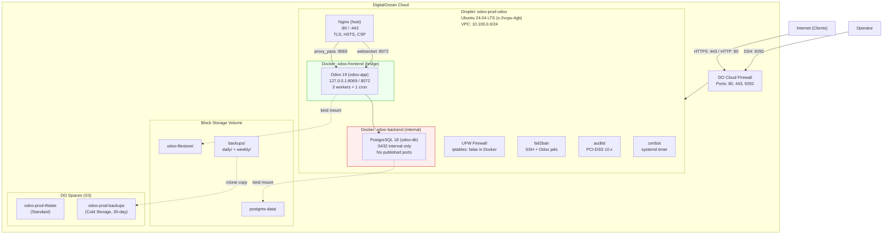

# Architecture Overview

Odoo Community 19.x deployed on a single DigitalOcean droplet (Ubuntu 24.04 LTS, s-2vcpu-4gb). Containerized with Docker Compose (Odoo + PostgreSQL 18), reverse-proxied by host-installed Nginx with Let's Encrypt SSL. PCI-DSS compliant security hardening. Designed for a 10-user CRM/PM workload.

## Network Topology (ASCII)

```
                          ┌───────────────────────────────────────────────┐
                          │            DigitalOcean Cloud                 │
                          │                                               │
  ┌──────────┐            │  ┌───────────────────────────────────────┐    │
  │ Internet │────────────┼──│     Cloud Firewall (odoo-prod-fw)    │    │
  │ (HTTPS)  │            │  │  Inbound: 80, 443, 9292 (SSH)        │    │
  └──────────┘            │  └──────────────────┬────────────────────┘    │
                          │                     │                         │
                          │  ┌──────────────────▼────────────────────┐    │
                          │  │  Droplet: odoo-prod-odoo              │    │
                          │  │  Ubuntu 24.04 LTS  (s-2vcpu-4gb)      │    │
                          │  │  VPC: 10.100.0.0/24                   │    │
                          │  │                                       │    │
                          │  │  ┌───────────────────────────────┐    │    │
                          │  │  │ Nginx (host, ports 80/443)    │    │    │
                          │  │  │ TLS termination, HSTS, CSP    │    │    │
                          │  │  └──────────┬────────────────────┘    │    │
                          │  │             │ proxy_pass               │    │
                          │  │  ┌──────────▼────────────────────┐    │    │
                          │  │  │ Docker: odoo-frontend network │    │    │
                          │  │  │ (bridge)                      │    │    │
                          │  │  │                               │    │    │
                          │  │  │  ┌─────────────────────────┐  │    │    │
                          │  │  │  │ Odoo 19 (odoo-app)      │  │    │    │
                          │  │  │  │ 127.0.0.1:8069 (HTTP)   │  │    │    │
                          │  │  │  │ 127.0.0.1:8072 (WS)     │  │    │    │
                          │  │  │  │ 3 workers + 1 cron       │  │    │    │
                          │  │  │  │ 2GB RAM / 1 CPU limit    │  │    │    │
                          │  │  │  └───────────┬─────────────┘  │    │    │
                          │  │  └──────────────┼────────────────┘    │    │
                          │  │  ┌──────────────▼────────────────┐    │    │
                          │  │  │ Docker: odoo-backend network  │    │    │
                          │  │  │ (bridge, internal)            │    │    │
                          │  │  │                               │    │    │
                          │  │  │  ┌─────────────────────────┐  │    │    │
                          │  │  │  │ PostgreSQL 18 (odoo-db)  │  │    │    │
                          │  │  │  │ Port 5432 (internal)     │  │    │    │
                          │  │  │  │ 1.2GB RAM / 0.5 CPU      │  │    │    │
                          │  │  │  │ No published ports        │  │    │    │
                          │  │  │  └─────────────────────────┘  │    │    │
                          │  │  └───────────────────────────────┘    │    │
                          │  │                                       │    │
                          │  │  Block Storage: /mnt/odoo-prod-data/  │    │
                          │  │  ├── postgres-data/                   │    │
                          │  │  ├── odoo-filestore/                  │    │
                          │  │  └── backups/                         │    │
                          │  │       ├── daily/   (7-day retention)  │    │
                          │  │       └── weekly/  (4-week retention) │    │
                          │  └───────────────────────────────────────┘    │
                          │                                               │
                          │  ┌───────────────────────────────────────┐    │
                          │  │ DO Spaces (S3-compatible)              │    │
                          │  │ odoo-prod-tfstate  (Standard)         │    │
                          │  │   └── terraform.tfstate               │    │
                          │  │ odoo-prod-backups  (Cold Storage)     │    │
                          │  │   └── YYYY/MM/odoo-*.dump             │    │
                          │  └───────────────────────────────────────┘    │
                          └───────────────────────────────────────────────┘
```

## Network Topology (Mermaid)



## Component Table

| Component | Location | Port(s) | Purpose | Key Config |
|-----------|----------|---------|---------|------------|
| Nginx | Host | 80, 443 | Reverse proxy, TLS termination, security headers | `/etc/nginx/sites-available/odoo` |
| Odoo 19 | Container (`odoo-app`) | 127.0.0.1:8069 (HTTP), 127.0.0.1:8072 (WebSocket) | ERP application (CRM, Project) | `/opt/odoo/odoo.conf` |
| PostgreSQL 18 | Container (`odoo-db`) | 5432 (backend network only) | Relational database | `/opt/odoo/postgresql.conf` |
| Docker CE | Host | -- | Container runtime | `/etc/docker/daemon.json` (`iptables: false`, log rotation) |
| UFW | Host | -- | Host firewall (single source of truth) | Rules for 80, 443, 9292 |
| fail2ban | Host | -- | Intrusion prevention | SSH jail (port 9292) + Odoo login jail |
| certbot | Host | -- | SSL certificate auto-renewal | systemd timer, twice daily with random delay |
| auditd | Host | -- | PCI-DSS 10.x compliance logging | `/etc/audit/rules.d/99-pci-dss.rules` |
| rclone | Host | -- | Offsite backup sync to DO Spaces | `/opt/odoo/rclone.conf` |
| msmtp | Host | -- | SMTP relay for failure notifications | `/opt/odoo/msmtprc` |

## Data Flow

### HTTPS Request Flow

1. **Client** sends HTTPS request to the domain
2. **DO Cloud Firewall** allows inbound on port 443 (and 80 for redirect)
3. **UFW** on the droplet permits ports 80/443
4. **Nginx** terminates TLS (Let's Encrypt certificate), applies security headers (HSTS, X-Frame-Options, CSP), and checks the route:
   - `/web/database/*` returns 403 (database manager blocked)
   - `/websocket` proxied to Odoo longpolling on 127.0.0.1:8072
   - All other paths proxied to Odoo HTTP on 127.0.0.1:8069
5. **Odoo** processes the request using one of 3 worker processes. Database queries route over the `odoo-backend` internal Docker network to PostgreSQL on port 5432
6. **PostgreSQL** executes the query, returns results to Odoo
7. Response flows back: Odoo -> Nginx -> Client

### Persistent Data

All persistent data lives on the Block Storage Volume mounted at `/mnt/odoo-prod-data/`:

- **PostgreSQL data** (`postgres-data/`) -- bind-mounted into the `odoo-db` container
- **Odoo filestore** (`odoo-filestore/`) -- bind-mounted into the `odoo-app` container; stores attachments, session data
- **Backups** (`backups/daily/`, `backups/weekly/`) -- pg_dump + filestore archives

This ensures data survives container recreation and droplet resize. The volume can be expanded independently via Terraform.

## Security Architecture

### Firewall (defense in depth)

- **Layer 1 -- DO Cloud Firewall:** Only ports 80, 443, and 9292 (SSH) reach the droplet. SSH restricted to operator IPs via Terraform `allowed_ssh_ips` variable.
- **Layer 2 -- UFW (host):** Mirrors cloud firewall rules. Docker daemon runs with `iptables: false` so UFW remains the single firewall source of truth.
- **Layer 3 -- Docker networks:** The `odoo-backend` network is `internal: true` -- PostgreSQL has no outbound internet access and no published ports.

### SSH Hardening

- Port 9292 (non-standard)
- Key-only authentication (passwords disabled)
- Root login disabled; `deploy` user with sudo
- MaxAuthTries 3, idle timeout 5 min
- fail2ban SSH jail (5 attempts / 10 min -> 10 min ban)

### Container Security

- Odoo runs as uid 101 (non-root)
- PostgreSQL runs as uid 999 (non-root)
- Resource limits: Odoo 2GB/1CPU, PostgreSQL 1.2GB/0.5CPU
- Health checks on both containers
- Docker log rotation (10MB x 3 files)

### Application Security

- Database manager blocked (`list_db = False` in odoo.conf AND Nginx 403 on `/web/database/*`)
- HSTS header (1 year, main domain only)
- Content Security Policy (restrictive, allows Odoo inline JS/CSS)
- OCSP stapling on TLS certificates
- fail2ban Odoo login jail (activates when Odoo logs exist)

### PCI-DSS Compliance

- auditd rules covering sections 10.2.1 through 10.2.7
- Immutable audit configuration (requires reboot to change)
- Logs for root commands, access denials, identity changes, file operations, time changes
- SSH and Docker daemon modification tracking

## Backup Architecture

Daily automated backups protect both database and filestore:

| Layer | What | Retention | Schedule |
|-------|------|-----------|----------|
| Local (Block Storage) | pg_dump custom format + filestore tar.gz | 7 daily, 4 weekly | 2:30 AM daily |
| Remote (DO Spaces) | Same files, Cold Storage bucket | 30 days | 3:30 AM daily (rclone copy) |

- **Database:** `pg_dump -Fc` via `docker exec` into the PostgreSQL container
- **Filestore:** `tar -czf` of `/mnt/odoo-prod-data/odoo-filestore/` (excludes sessions/addons)
- **Weekly:** Sunday's daily backup promoted to `weekly/` directory
- **Offsite:** `rclone copy` (not sync) to `odoo-prod-backups` Cold Storage bucket, organized as `YYYY/MM/`
- **Status:** JSON status file at `/opt/odoo/backup-status.json` for Phase 5 Icinga2 monitoring
- **Alerts:** Email notifications via msmtp on backup failure

Restore procedures and verification are documented in [docs/operations.md](operations.md).

## Infrastructure Diagram

```
┌─────────────────────────────────────────────────────────────────┐
│                     DigitalOcean Account                        │
│                                                                 │
│  ┌──────────────────────────────────────────────────────────┐   │
│  │ VPC: odoo-prod-vpc  (10.100.0.0/24)                      │   │
│  │                                                           │   │
│  │  ┌────────────────────────────────────────────────────┐   │   │
│  │  │ Droplet: odoo-prod-odoo                            │   │   │
│  │  │ Image: Ubuntu 24.04 LTS                            │   │   │
│  │  │ Size: s-2vcpu-4gb (2 vCPU / 4 GB RAM)             │   │   │
│  │  │ Region: nyc3                                       │   │   │
│  │  └────────────────────────────────────────────────────┘   │   │
│  │                    │                                       │   │
│  │  ┌─────────────────▼──────────────────────────────────┐   │   │
│  │  │ Volume: odoo-prod-data (25 GB, ext4)               │   │   │
│  │  │ Mount: /mnt/odoo-prod-data/                        │   │   │
│  │  │ Contents: postgres-data, odoo-filestore, backups   │   │   │
│  │  └────────────────────────────────────────────────────┘   │   │
│  └──────────────────────────────────────────────────────────┘   │
│                                                                 │
│  ┌──────────────────────────┐  ┌─────────────────────────────┐  │
│  │ Cloud Firewall            │  │ Spaces Buckets               │  │
│  │ odoo-prod-fw              │  │                              │  │
│  │ Rules:                    │  │ odoo-prod-tfstate (Standard) │  │
│  │  IN: 80, 443, 9292 (TCP) │  │  terraform.tfstate           │  │
│  │  OUT: all                 │  │                              │  │
│  │ Attached to: droplet      │  │ odoo-prod-backups (Cold)     │  │
│  └──────────────────────────┘  │  YYYY/MM/odoo-*.dump          │  │
│                                 │  30-day retention             │  │
│                                 └─────────────────────────────┘  │
└─────────────────────────────────────────────────────────────────┘
```

All infrastructure is provisioned by Terraform (see `infra/`). State is stored remotely in the `odoo-prod-tfstate` Spaces bucket.

---

*Requirement coverage: DOC-01*
*Last updated: 2026-03-17*
